# Roblox Web API
#### How to use it.
----------------
##### In order to use the web api you must get your user cookie. Do not share this with anyone. If you do not do this on an incognito window you must keep that window open. If you do this on an incognito window you can close the window. Everything that I put here must go in an async function because they use await. 
----------------
##### This tutorial uses axios to make http requests. To require it say : const axios = require('axios').default To download it type this into the terminal npm install -g axios
----------------

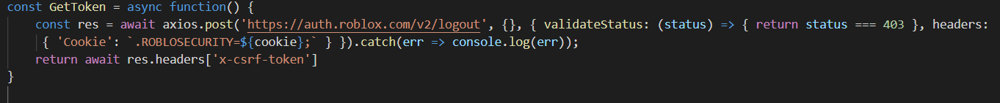

##### Here you make a post request. The area where it says ${cookie} you want to making a cookie varaible called cookie and put your acount cookie in it.

----------------

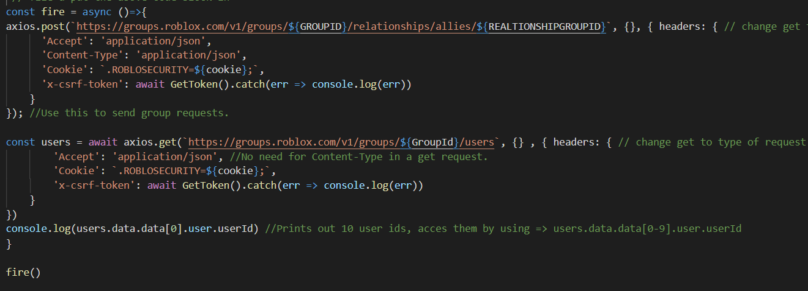

##### The first examples shows an axios post request that creates a group relationship. The first link is where you want the request to go to. This will include any varaibles they need such as your group id, the other group id, and the type (ally or enemy) where is says allies you can replace that with enemies to make an enemy request.
----------------
##### The second examples is a get request. You take the url you get from their api and fill in any neccesary varaibles. Here we get group members so we need the group id varaible. Notice how there is no content-type. This is because this is a get request. We do not need to psot anything. Also notice how every request takes in the cookie varaible. This is because it makes roblox think that you are logged in so you have the ability to do this. Each time you login you get a new cookie which is why we got it from the incognito window at the start.
----------------
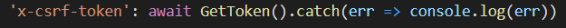
##### Like in the post request also in the get request we need the x-csrf-token. To get this token we call the function I put above, the GetToken() function. We want to use await because we need to wait for the request to finish to get the token. We then want the catch to tell us the error is there is one.
----------------

##### Here I print out user ID 0 from the get request. Because I am using axios we need to put res or users.data.data axios makes us put one extra data there. users.data would return this a confusing table full of values that say this [Object] while users.data.data would reutrn a table like this: 
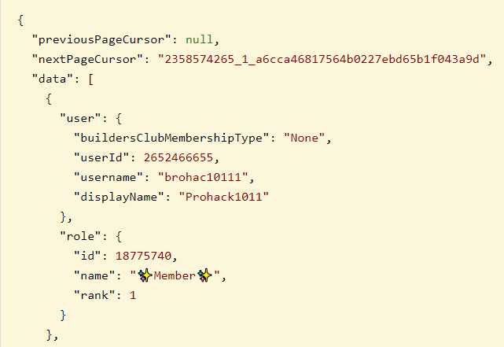
##### The only difference from your would be that there would be a table of 19 different ones of these each for different users. This get can return up to 100 different user tables. But I did not do that here. It defaults to 10 if you do not specify the amount. For more information on this api go to https://groups.roblox.com/docs#/
---------------
## How the API Website Works
##### This section is on how to go the api.roblox.com and use any api and understand how it works.

##### I will be using friends.roblox.com for this tutorial, we will be unfriending a user.

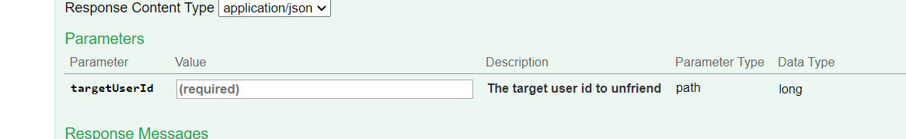

##### As you see here there is only one parameter need and it is required to unfriend a user. You need their user id. For this tutorial I will be using my ID as an example.

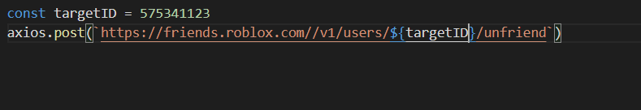
##### Here I am creating a post request. I will just need the ID of the user you are going to unfriend. That is called the targetID in my script.
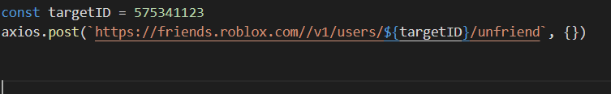
##### Because we do not have to post any data we leave the next table empty.
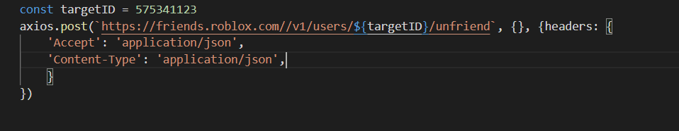
##### We are now putting in our headers that are needed to make the request. This is a table. Because it is a post we need a content-type which is application/json because it is a json table. We accept a json table, it returns a json table so for the accept we put application/json. It tells you to put application.json here in the website:
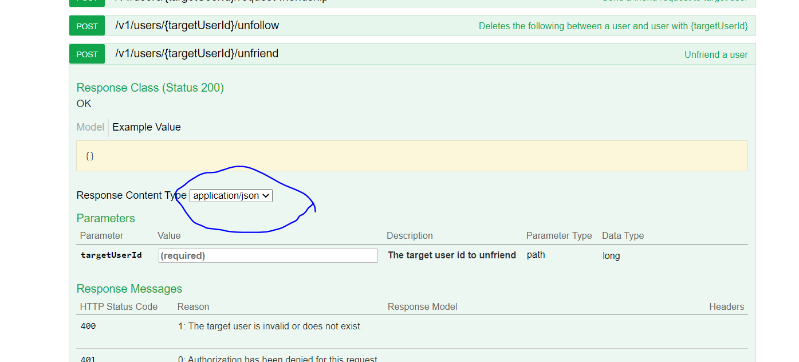

--------------
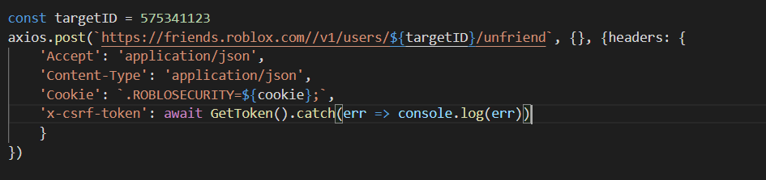
##### Here we put in the final headers, the roblosecurity cookie and the x-csrf-token. The roblosecurity is pretty straight forward. To get the x-csrf-token we use the async function we made. We want to put await and catch there incase there is an error to tell us what it is an to make sure the script waits for the request to be done before moving on.

##### To test if you parameter will work just enter them into the textbox in the website then click try it out! Like this :

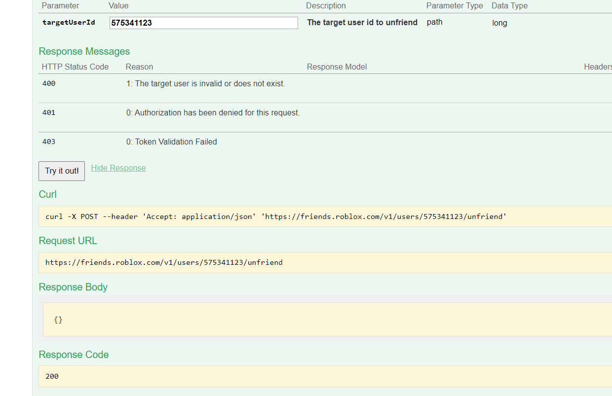

##### Mine did not work because I am not friend with that account on the alt account. But if you were it would work!

-------------
-------------

#### That is all on my roblox api tutorial mostly for myself. If this did help you and you are not me awesome. I understand I am bad at .md.